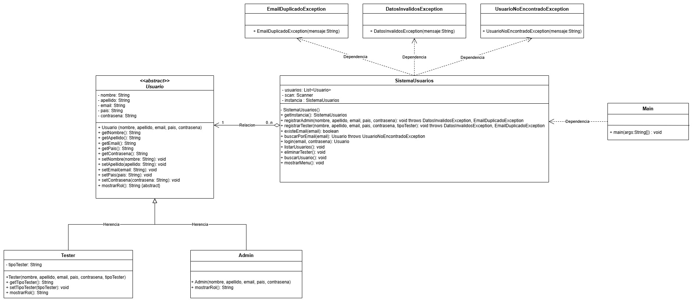

Funcionalidades:
- Inicio de sesión: Permite acceder al sistema con un usuario.
  Datos: email, contraseña.
- Registrar usuario admin: Permite registrar un usuario administrador.
  Datos: nombre, apellido, mail, contraseña, pais de nacimiento.
- Ver usuarios: Permite ver todos los usuarios registrados.
- Reiniciar contraseña:Permite reestablecer la contraseña de un usuario.
  Datos: email, contraseña
- Alta de cuenta para tester: Registrar usuario tester.
  Datos: Nombre, Apellido, Email, Pais, Contraseña, Tipo de Tester (Jr., Sr., Líder)
- Ver y editar perfil de usuario admin: Permite ver datos del propio usuario y editarlos.
- Eliminar usuario: Solo permite eliminar usuarios de tester

Diagrama UML actualizado:

